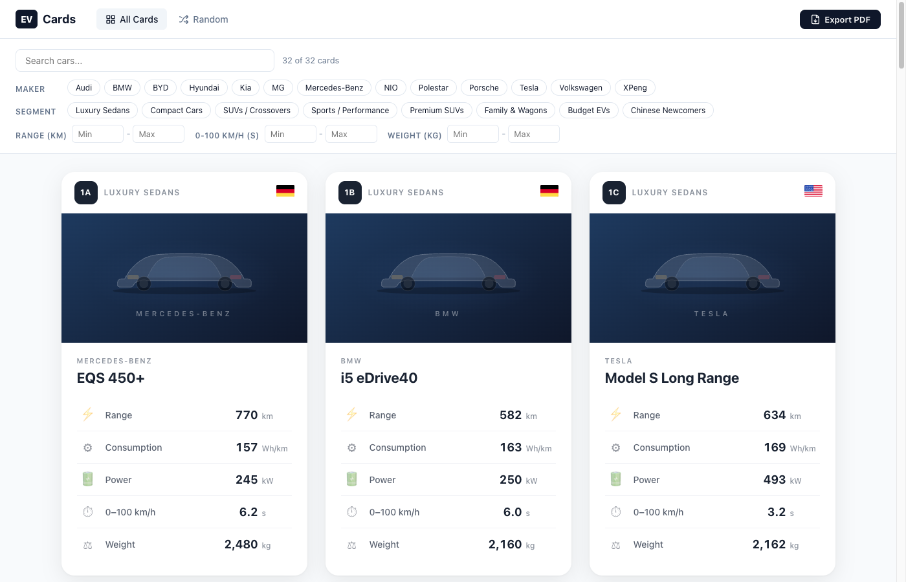

# EV Cards

A web application for browsing and printing EV (Electric Vehicle) quartets playing cards. Features 32 real EV models organized into 8 quartets by segment.



## Getting Started

### Prerequisites

- [Node.js](https://nodejs.org/) (v18 or later)

### Installation

```bash
npm install
```

### Development

```bash
npm run dev
```

Open [http://localhost:5173](http://localhost:5173) in your browser.

### Production Build

```bash
npm run build
npm run preview
```

## Features

- **32 EV cards** in 8 quartets: Luxury Sedans, Compact Cars, SUVs/Crossovers, Sports/Performance, Premium SUVs, Family & Wagons, Budget EVs, Chinese Newcomers
- **Filtering** by maker, segment, range, acceleration, and weight
- **Random card** page with shuffle
- **PDF export** to A4 layout for printing and cutting out physical cards
- **Card specs**: Range (km), Consumption (Wh/km), Power (kW), 0-100 km/h (s), Weight (kg)
- Country flags showing maker origin

## Adding Car Images

Replace the gradient placeholders with real images by:

1. Add image files to `public/images/cars/`
2. Set the `image` field in `src/data/cars.ts` for each car, e.g.:
   ```ts
   image: '/images/cars/tesla-model-3.jpg'
   ```

## Tech Stack

- React + TypeScript
- Vite
- React Router
- jsPDF + html2canvas (PDF export)
- country-flag-icons (SVG flags)
